# Execution Plan: amayakashi-log

## Detailed Analysis Summary

### Project Type
**Greenfield Project** - 新規プロジェクト（既存コードなし）

### Change Impact Assessment

#### User-facing changes
**Yes** - 大規模なユーザー体験の変更
- Windowsデスクトップアプリケーション（PyQt6）
- Web管理画面（Flask）
- 複数のユーザーワークフロー（出勤→業務中→終業→退勤）
- AIキャラクターとのインタラクション

#### Structural changes
**Yes** - 新規システムアーキテクチャの構築
- クライアント・サーバー・AI統合の3層アーキテクチャ
- マルチモーダルログ取得システム
- AI生成パイプライン
- WebSocket通知システム

#### Data model changes
**Yes** - 新規データモデルの設計
- ユーザーデータ
- ログデータ（マルチモーダル）
- AIキャラクターマスタ
- 生成結果（上司日誌、甘やかしログ）

#### API changes
**Yes** - 新規API設計
- REST API（クライアント・サーバー間）
- WebSocket API（リアルタイム通知）
- AWS Bedrock統合
- OpenAI Whisper統合

#### NFR impact
**Yes** - 重要な非機能要件
- パフォーマンス（リアルタイムログ取得、AI生成時間）
- セキュリティ（プライバシー保護、データ暗号化）
- スケーラビリティ（複数ユーザー対応）
- 可用性（24時間稼働）

### Risk Assessment
- **Risk Level**: High（高）
- **Rationale**: 
  - 複雑な3層アーキテクチャ
  - マルチモーダルAI統合
  - プライバシーとセキュリティの重要性
  - 複数の技術スタック（PyQt6, Flask, AWS Bedrock, Whisper, PostgreSQL）
- **Rollback Complexity**: N/A（新規プロジェクト）
- **Testing Complexity**: Complex（複雑）
  - クライアント・サーバー統合テスト
  - AI生成品質テスト
  - プライバシー機能テスト
  - パフォーマンステスト

---

## Workflow Visualization

```mermaid
flowchart TD
    Start(["User Request"])
    
    subgraph INCEPTION["🔵 INCEPTION PHASE"]
        WD["Workspace Detection<br/><b>COMPLETED</b>"]
        RA["Requirements Analysis<br/><b>COMPLETED</b>"]
        US["User Stories<br/><b>COMPLETED</b>"]
        WP["Workflow Planning<br/><b>IN PROGRESS</b>"]
        AD["Application Design<br/><b>EXECUTE</b>"]
        UG["Units Generation<br/><b>EXECUTE</b>"]
    end
    
    subgraph CONSTRUCTION["🟢 CONSTRUCTION PHASE"]
        FD["Functional Design<br/>(per-unit)<br/><b>EXECUTE</b>"]
        NFRA["NFR Requirements<br/>(per-unit)<br/><b>EXECUTE</b>"]
        NFRD["NFR Design<br/>(per-unit)<br/><b>EXECUTE</b>"]
        ID["Infrastructure Design<br/>(per-unit)<br/><b>EXECUTE</b>"]
        CG["Code Generation<br/>(per-unit)<br/><b>EXECUTE</b>"]
        BT["Build and Test<br/><b>EXECUTE</b>"]
    end
    
    subgraph OPERATIONS["🟡 OPERATIONS PHASE"]
        OPS["Operations<br/><b>PLACEHOLDER</b>"]
    end
    
    Start --> WD
    WD --> RA
    RA --> US
    US --> WP
    WP --> AD
    AD --> UG
    UG --> FD
    FD --> NFRA
    NFRA --> NFRD
    NFRD --> ID
    ID --> CG
    CG -.->|Next Unit| FD
    CG --> BT
    BT -.-> OPS
    BT --> End(["Complete"])
    
    style WD fill:#4CAF50,stroke:#1B5E20,stroke-width:3px,color:#fff
    style RA fill:#4CAF50,stroke:#1B5E20,stroke-width:3px,color:#fff
    style US fill:#4CAF50,stroke:#1B5E20,stroke-width:3px,color:#fff
    style WP fill:#FFA726,stroke:#E65100,stroke-width:3px,color:#000
    style AD fill:#FFA726,stroke:#E65100,stroke-width:3px,stroke-dasharray: 5 5,color:#000
    style UG fill:#FFA726,stroke:#E65100,stroke-width:3px,stroke-dasharray: 5 5,color:#000
    style FD fill:#FFA726,stroke:#E65100,stroke-width:3px,stroke-dasharray: 5 5,color:#000
    style NFRA fill:#FFA726,stroke:#E65100,stroke-width:3px,stroke-dasharray: 5 5,color:#000
    style NFRD fill:#FFA726,stroke:#E65100,stroke-width:3px,stroke-dasharray: 5 5,color:#000
    style ID fill:#FFA726,stroke:#E65100,stroke-width:3px,stroke-dasharray: 5 5,color:#000
    style CG fill:#4CAF50,stroke:#1B5E20,stroke-width:3px,color:#fff
    style BT fill:#4CAF50,stroke:#1B5E20,stroke-width:3px,color:#fff
    style OPS fill:#BDBDBD,stroke:#424242,stroke-width:2px,stroke-dasharray: 5 5,color:#000
    style INCEPTION fill:#BBDEFB,stroke:#1565C0,stroke-width:3px,color:#000
    style CONSTRUCTION fill:#C8E6C9,stroke:#2E7D32,stroke-width:3px,color:#000
    style OPERATIONS fill:#FFF59D,stroke:#F57F17,stroke-width:3px,color:#000
    style Start fill:#CE93D8,stroke:#6A1B9A,stroke-width:3px,color:#000
    style End fill:#CE93D8,stroke:#6A1B9A,stroke-width:3px,color:#000
    
    linkStyle default stroke:#333,stroke-width:2px
```

---

## Phases to Execute

### 🔵 INCEPTION PHASE

#### ✅ Completed Stages
- [x] **Workspace Detection** (COMPLETED - 2026-04-30T09:00:00Z)
  - Greenfield project confirmed
  - No existing code detected
  
- [x] **Requirements Analysis** (COMPLETED - 2026-04-30T09:15:00Z)
  - 詳細な要件定義書作成
  - 技術的決定事項確定
  - 拡張ルール設定完了

- [x] **User Stories** (COMPLETED - 2026-04-30T09:55:00Z)
  - 3つのペルソナ定義
  - 34+のユーザーストーリー作成
  - INVEST基準準拠

- [x] **Workflow Planning** (IN PROGRESS)
  - 実行計画作成中

#### 📋 Stages to Execute

- [ ] **Application Design** - **EXECUTE**
  - **Rationale**: 新規システムのため、コンポーネント設計が必要
  - **Scope**: 
    - クライアント側コンポーネント（ウィジェット、サマリーエディタ、設定画面）
    - サーバー側コンポーネント（WebAPI、Web管理画面、AI統合）
    - データベーススキーマ設計
    - コンポーネント間のインターフェース定義
  - **Deliverables**:
    - components.md - コンポーネント一覧と責務
    - component-methods.md - 各コンポーネントのメソッド定義
    - services.md - サービス層設計
    - database-schema.md - データベーススキーマ

- [ ] **Units Generation** - **EXECUTE**
  - **Rationale**: 複雑なシステムのため、作業単位への分解が必要
  - **Scope**:
    - クライアント側ユニット（ログ取得、UI、ローカル処理）
    - サーバー側ユニット（WebAPI、AI統合、データベース）
    - 共通ユニット（データモデル、ユーティリティ）
  - **Deliverables**:
    - unit-of-work.md - 作業単位の定義
    - unit-of-work-dependency.md - ユニット間の依存関係
    - unit-of-work-story-map.md - ユーザーストーリーとのマッピング

---

### 🟢 CONSTRUCTION PHASE

#### 📋 Per-Unit Design Stages (各ユニットごとに実行)

- [ ] **Functional Design** - **EXECUTE** (per-unit)
  - **Rationale**: 新規ビジネスロジックの詳細設計が必要
  - **Scope**:
    - データモデル設計
    - ビジネスルール定義
    - アルゴリズム設計
  - **Deliverables** (per-unit):
    - functional-design.md - 機能設計書

- [ ] **NFR Requirements** - **EXECUTE** (per-unit)
  - **Rationale**: パフォーマンス、セキュリティ、スケーラビリティの要件定義が必要
  - **Scope**:
    - パフォーマンス要件（ログ取得頻度、AI生成時間）
    - セキュリティ要件（プライバシー保護、データ暗号化）
    - スケーラビリティ要件（複数ユーザー対応）
    - 技術スタック選択
  - **Deliverables** (per-unit):
    - nfr-requirements.md - 非機能要件定義書

- [ ] **NFR Design** - **EXECUTE** (per-unit)
  - **Rationale**: NFR要件を満たす設計パターンの適用が必要
  - **Scope**:
    - パフォーマンス最適化設計
    - セキュリティパターン適用
    - スケーラビリティ設計
  - **Deliverables** (per-unit):
    - nfr-design.md - NFR設計書

- [ ] **Infrastructure Design** - **EXECUTE** (per-unit)
  - **Rationale**: AWS EC2、RDS、Bedrockの統合設計が必要
  - **Scope**:
    - AWS EC2設定（Flaskサーバー）
    - AWS RDS (PostgreSQL)設定
    - AWS Bedrock統合
    - ネットワーク設計
    - セキュリティグループ設定
  - **Deliverables** (per-unit):
    - infrastructure-design.md - インフラ設計書

#### 📋 Always Execute Stages

- [ ] **Code Generation** - **EXECUTE** (per-unit, ALWAYS)
  - **Rationale**: 実装計画とコード生成が必要
  - **Scope**:
    - Part 1: Planning - 詳細な実装計画作成
    - Part 2: Generation - コード生成、テスト生成
  - **Deliverables** (per-unit):
    - code-generation-plan.md - コード生成計画
    - 実装コード（クライアント・サーバー）
    - ユニットテスト
    - 統合テスト

- [ ] **Build and Test** - **EXECUTE** (ALWAYS)
  - **Rationale**: ビルド、テスト、検証が必要
  - **Scope**:
    - すべてのユニットのビルド
    - ユニットテスト実行
    - 統合テスト実行
    - パフォーマンステスト実行
  - **Deliverables**:
    - build-instructions.md - ビルド手順
    - unit-test-instructions.md - ユニットテスト手順
    - integration-test-instructions.md - 統合テスト手順
    - performance-test-instructions.md - パフォーマンステスト手順
    - build-and-test-summary.md - ビルド・テストサマリー

---

### 🟡 OPERATIONS PHASE

- [ ] **Operations** - **PLACEHOLDER**
  - **Rationale**: 将来のデプロイと監視ワークフロー用のプレースホルダー
  - **Current State**: すべてのビルドとテスト活動はCONSTRUCTIONフェーズで処理

---

## Estimated Timeline

### Phase Breakdown
- **INCEPTION Phase**: 
  - Application Design: 2-3日
  - Units Generation: 1-2日
  - **小計**: 3-5日

- **CONSTRUCTION Phase** (ユニット数により変動):
  - Per-Unit Design (Functional, NFR, Infrastructure): 2-3日/ユニット
  - Code Generation: 3-5日/ユニット
  - Build and Test: 2-3日
  - **小計**: 予想ユニット数5-7の場合、25-40日

- **Total Estimated Duration**: 28-45日（約4-6週間）

**Note**: これは概算であり、実際の期間はユニットの複雑さと並行作業の可能性により変動します。

---

## Success Criteria

### Primary Goal
業務ログをAI解析し、上司向け報告書を自動生成すると同時に、複数のAIアシスタントがユーザーを褒めちぎることで、労働による孤独を解消し自己肯定感を最大化させる総合メンタルケア・プラットフォームの完成

### Key Deliverables
1. **Windowsデスクトップアプリケーション（PyQt6）**
   - ログ取得機能（マルチモーダル）
   - サマリーエディタ
   - 設定画面

2. **Flaskサーバー（WebAPI + Web管理画面）**
   - REST API
   - WebSocket通知
   - Web管理画面

3. **AI統合**
   - AWS Bedrock統合（Claude 4）
   - OpenAI Whisper統合（ローカル実行）

4. **データベース**
   - AWS RDS (PostgreSQL)スキーマ
   - データ永続化

5. **ドキュメント**
   - 設計書
   - ビルド・テスト手順書
   - ユーザーマニュアル

### Quality Gates
1. **機能的品質**
   - すべてのユーザーストーリーの受け入れ基準を満たす
   - ユニットテストカバレッジ80%以上
   - 統合テスト成功率100%

2. **非機能的品質**
   - ログ取得がユーザーの業務を妨げない（CPU使用率5%以下）
   - AI生成が1分以内に完了
   - プライバシー設定が適切に機能
   - 生ログが1週間後に自動削除

3. **ユーザー体験的品質**
   - ユーザーが「癒やされた」と感じる
   - 業務日誌作成の手間が大幅に削減される
   - AIキャラクターに愛着を感じる

---

## Risks and Mitigation

### Technical Risks
1. **Whisperローカル実行のリソース消費**
   - **Risk**: クライアント側のCPU/メモリ使用量が高い
   - **Mitigation**: パフォーマンステストで検証、必要に応じてサーバー側実行に変更

2. **AWS Bedrock API制限**
   - **Risk**: API呼び出し制限やコスト超過
   - **Mitigation**: レート制限実装、コスト監視、キャッシング戦略

3. **マルチモーダル解析の処理時間**
   - **Risk**: AI生成に時間がかかりすぎる
   - **Mitigation**: 非同期処理、プログレスバー表示、タイムアウト設定

### Privacy Risks
1. **カメラ・マイクのプライバシー侵害**
   - **Risk**: ユーザーのプライバシー侵害の懸念
   - **Mitigation**: 初回起動時の選択、ブラックリスト機能、生ログの自動削除

2. **スクリーンショットの機密情報漏洩**
   - **Risk**: 機密情報がスクショに含まれる
   - **Mitigation**: ブラックリスト機能、データ暗号化、生ログの自動削除

### Project Risks
1. **複雑な3層アーキテクチャ**
   - **Risk**: 統合の複雑さによる遅延
   - **Mitigation**: 段階的統合、継続的統合テスト

2. **複数の技術スタック**
   - **Risk**: 技術的な学習曲線
   - **Mitigation**: プロトタイプ作成、技術検証

---

**文書作成日**: 2026-04-30  
**作成者**: AI-DLC System  
**バージョン**: 1.0
